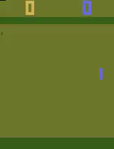

# Atari DQN: End-to-End Reinforcement Learning System


This repository contains a production-grade Reinforcement Learning (RL) system for training and deploying an AI agent capable of playing Atari games, specifically optimized for `ALE/Pong-v5`. The project implements a Deep Q-Network (DQN) from scratch and wraps it in a robust MLOps pipeline using Docker and FastAPI.

## Demo

| | | | |
|:---:|:---:|:---:|:---:|
|  |  |  |  |
|  |  |  |  |

*The trained DQN agent playing Atari Pong across multiple episodes.*

## Quick Start

The project is orchestrated via `submission.yml` to ensure total reproducibility.

### Prerequisites

- Docker installed with GPU support (optional but recommended)
- Python 3.10+ with `uv` package manager (for local development)

### Using Docker Compose (Simplest)

```bash
# Start the inference API
docker compose up api

# Run training (requires GPU)
docker compose up train

# Run evaluation
docker compose up evaluate
```

### Using Docker (Manual)

1. **Build the environments:**
```bash
docker build -t atari-dqn-train -f Dockerfile.train .
docker build -t atari-dqn-api -f Dockerfile.inference .
```

2. **Train the agent:**
```bash
docker run --gpus all -v $(pwd):/app/output atari-dqn-train python train.py
```

3. **Evaluate performance:**
```bash
docker run -v $(pwd):/app/output atari-dqn-train python evaluate.py --episodes 100
```

4. **Start the API:**
```bash
docker run -p 8000:8000 atari-dqn-api
```

### Local Development

1. **Setup environment:**
```bash
pip install uv
uv sync
```

2. **Train locally:**
```bash
uv run python src/train.py
```

3. **Evaluate:**
```bash
uv run python src/evaluate.py --episodes 100
```

4. **Generate video:**
```bash
uv run python src/evaluate.py --record True
```

## System Architecture

The system is built on three pillars:

### 1. Data Pipeline (`atari_env_wrapper.py`)

Utilizes a chain of Gymnasium wrappers to transform raw pixels into a state representation:

- **Frame Skipping:** Skips 4 frames and takes the max-pool of the last 2 to eliminate flickering.
- **Preprocessing:** Converts RGB frames to grayscale and resizes them to 84x84.
- **Frame Stacking:** Concatenates 4 consecutive frames to provide the agent with temporal information (velocity).

### 2. DQN Implementation (`agent.py`, `model.py`, `memory.py`)

- **Architecture:** A Nature DQN CNN with 3 convolutional layers and 2 dense layers.
- **Stability:** Implements a Target Network, Huber Loss, and Reward Clipping for stable learning.
- **Memory:** A high-performance Experience Replay Buffer using pre-allocated NumPy arrays for O(1) sampling efficiency.

### 3. MLOps & Deployment (`app.py`, `Dockerfile`)

- **Experiment Tracking:** Integrates MLflow to log rewards, loss, and epsilon decay.
- **API Service:** A FastAPI-based REST service with a `/predict` endpoint for real-time inference.
- **Containerization:** Separate Docker builds for training and slim inference images.

## API Usage

Start the inference server:
```bash
docker run -p 8000:8000 atari-dqn-api
```

Make a prediction:
```bash
curl -X POST "http://localhost:8000/predict" \
  -H "Content-Type: application/json" \
  -d '{"state": <4x84x84 array>}'
```

Response:
```json
{"action": 2}
```

## Tech Stack

| Component | Technology |
|-----------|------------|
| RL Framework | Gymnasium |
| Deep Learning | PyTorch |
| API | FastAPI & Uvicorn |
| Infrastructure | Docker, MLflow |
| Language | Python 3.10+ |

## Documentation

- `METHODOLOGY.md`: Detailed breakdown of hyperparameter choices and training analysis.

## License

MIT License