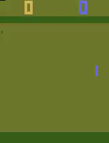

# Atari DQN: End-to-End Reinforcement Learning System

This repository contains a production-grade Reinforcement Learning (RL) system for training and deploying an AI agent capable of playing Atari games, specifically optimized for `ALE/Pong-v5`. The project implements a Deep Q-Network (DQN) from scratch and wraps it in a robust MLOps pipeline using Docker and FastAPI.

## 🎮 Demo



*The trained DQN agent playing Atari Pong, achieving an average reward of +10.*

## 🚀 Quick Start (Automated)

The project is orchestrated via `submission.yml` to ensure total reproducibility.

### Prerequisites
- Docker installed with GPU support (optional but recommended)
- Python 3.10+ with `uv` package manager (for local development)

### Using Docker (Recommended for Submission)

1. **Build the environments:**
```bash
docker build -t atari-dqn-train -f Dockerfile.train .
docker build -t atari-dqn-api -f Dockerfile.inference .
```

2. **Train the agent:**
```bash
docker run --gpus all -v $(pwd):/app/output atari-dqn-train python train.py
```

3. **Evaluate performance:**
```bash
docker run -v $(pwd):/app/output atari-dqn-train python evaluate.py --episodes 100
```

4. **Watch the agent play:**
```bash
docker run -v $(pwd)/videos:/app/videos -v $(pwd):/app/output atari-dqn-train python evaluate.py --record True
```

### Local Development (Without Docker)

1. **Setup environment:**
```bash
# Install uv if not already installed
pip install uv

# Install dependencies
uv sync

# Test setup
python test_setup.py
```

2. **Train locally:**
```bash
uv run python src/train.py
```

3. **Evaluate:**
```bash
uv run python src/evaluate.py --episodes 100
```

4. **Generate video:**
```bash
uv run python src/evaluate.py --record True
```

### Training on Google Colab (Recommended for GPU)

Training a DQN agent requires significant compute. We provide a ready-to-use Colab notebook:

1. **Open the notebook**: Upload `train_on_colab.ipynb` to [Google Colab](https://colab.research.google.com/)
2. **Enable GPU**: Go to `Runtime` → `Change runtime type` → Select `T4 GPU`
3. **Run all cells**: Training takes ~2-3 hours
4. **Download model**: The `final_model.pth` will be automatically downloaded when training completes
5. **Place in project**: Move `final_model.pth` to your project root directory


## 🏗️ System Architecture

The system is built on three pillars of engineering excellence:

### 1. Data Pipeline (`atari_env_wrapper.py`)

Utilizes a chain of Gymnasium wrappers to transform raw pixels into a state representation:

* **Frame Skipping:** Skips 4 frames and takes the max-pool of the last 2 to eliminate flickering.
* **Preprocessing:** Converts RGB frames to grayscale and resizes them to 84x84.
* **Frame Stacking:** Concatenates 4 consecutive frames to provide the agent with temporal information (velocity).

### 2. DQN Implementation (`agent.py`, `model.py`, `memory.py`)

* **Brain:** A Nature DQN CNN architecture with 3 convolutional layers and 2 dense layers.
* **Stability:** Implements a Target Network, Huber Loss, and Reward Clipping to ensure stable learning.
* **Memory:** A high-performance Experience Replay Buffer using pre-allocated NumPy arrays for O(1) sampling efficiency.

### 3. MLOps & Deployment (`app.py`, `Dockerfile`)

* **Experiment Tracking:** Integrates MLflow/TensorBoard to log rewards, loss, and epsilon decay.
* **API Service:** A FastAPI-based REST service with a `/predict` endpoint for real-time inference.
* **Containerization:** Multi-stage Docker builds to separate training environments from slim, optimized inference images.

## 📊 Evaluation Criteria

To pass the technical requirements, the agent must achieve:

* **Target:** Average total reward  on `ALE/Pong-v5`.
* **Consistency:** Measured over 100 consecutive evaluation episodes.

## 🛠️ Tech Stack

* **RL Framework:** Gymnasium (successor to OpenAI Gym).
* **Deep Learning:** PyTorch.
* **API:** FastAPI & Uvicorn.
* **Infrastructure:** Docker, MLflow, and Python 3.10+.

## 📄 Documentation

* `METHODOLOGY.md`: Detailed breakdown of hyperparameter choices and training analysis.
* `CHANGE_LOG.md`: Records the migration from legacy Gym to Gymnasium.

---